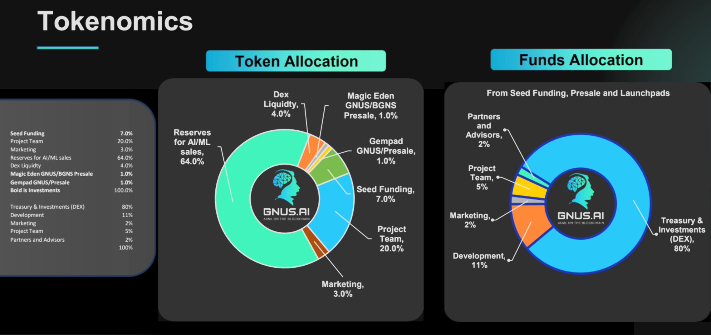

# Tokenomics

Disclosure of Funds Raised, Token Distributions, and Funds Usage

<figure><figcaption>
Tokenomics for Token Raise Distribution
</figcaption></figure>

## Compute-Driven Token Growth

The following graph shows our [Monte Carlo](https://my.machinations.io/d/gnus-economy/8683592da7e911eda2330626ff1c9bc8) simulation using two Enterprises buying AI/ML processing and three games with 12 online players.

* Multiple Revenue Streams
  * AI/ML Processing revenue, as well as Crypto & NFT trading fee revenue
* Crypto Token Advantages
  * Mint & Burn allows configurable profits.
* Investments Scale the Network
  * Investments are used to scale the network by adding nodes.
* Monte Carlo Analysis Simulation
  * Monte Carlo Analysis shows the network effect. Faster network scaling increases GNUS token price faster.

<figure><figcaption>
Compute-Driven Token Growth over 700 days
</figcaption></figure>

<figure><figcaption>
Circulating Supply
</figcaption></figure>

The GNUS token is itself subdivided into units called "Minions".  1 GNUS = 10^9 Minions.  Internal SuperGenius ledgers use 64 bit values to hold Minions, which translates to a single GNUS wallet address being able to hold a max balance of 18.4 billion GNUS (with a fractional/decimal precision of 10^9).
