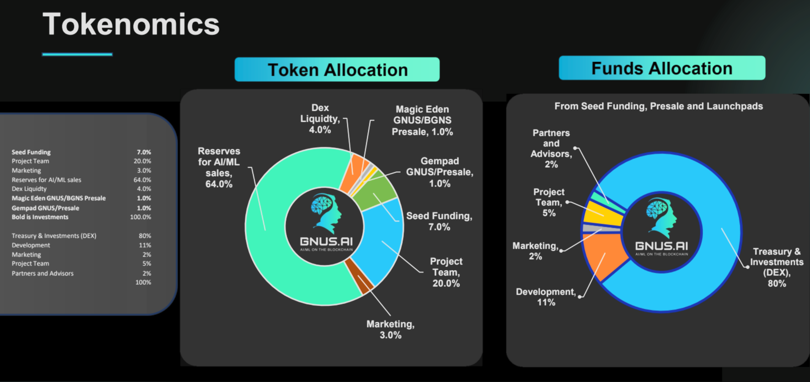

# Tokenomics

Disclosure of Funds Raised, Token Distributions, and Funds Usage

<figure><figcaption>
Tokenomics for Token Raise Distribution
</figcaption></figure>

## Compute-Driven Token Growth

The following graph shows our [Monte Carlo](https://my.machinations.io/d/gnus-economy/8683592da7e911eda2330626ff1c9bc8) simulation using two Enterprises buying AI/ML processing and three games with 12 online players.

* Multiple Revenue Streams
  * AI/ML Processing revenue, as well as Crypto & NFT trading fee revenue
* Crypto Token Advantages
  * Mint & Burn allows configurable profits.
* Investments Scale the Network
  * Investments are used to scale the network by adding nodes.
* Monte Carlo Analysis Simulation
  * Monte Carlo Analysis shows the network effect. Faster network scaling increases GNUS token price faster.

<figure><figcaption>
Compute-Driven Token Growth over 700 days
</figcaption></figure>

<figure><figcaption>
Circulating Supply
</figcaption></figure>

The GNUS token is subdivided into units called **Minions**. The current SuperGenius `TokenAmount` implementation represents **1 GNUS as 1,000,000 Minions (six decimal places)** using an unsigned 64-bit integer. The earlier nine-decimal and 18.4-billion-GNUS-per-wallet figures are outdated for that internal representation. Confirm the precision used by each EVM token contract separately; the native ledger unit does not determine ERC-20 or ERC-1155 decimals.

**Burn configuration:** The SuperGenius `BurnConfig` implementation defines a **100-basis-point (1%) genesis default**, with quorum-controlled changes by trusted peers. It does **not** establish a fixed 10% burn for every processing payout. A default is not proof of the current live network setting. Token burning does not, by itself, guarantee an increase in token price.

See [Platform Status](../release-status.md) for the distinction between completed native mainnet implementation and public activation.
