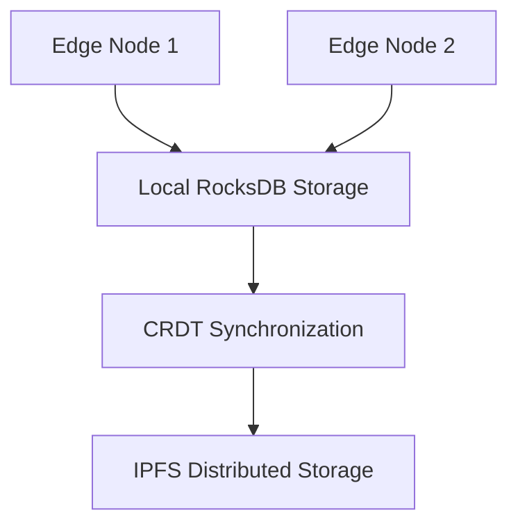

# Data Storage

## RocksDB over IPFS with CRDT Syncing

### Architecture

- **RocksDB** is used for local storage of vector slices on each node.
- **IPFS** ensures distributed storage with content-addressed paths for retrieval.
- **CRDTs** manage synchronization across nodes to avoid conflicts during updates.

