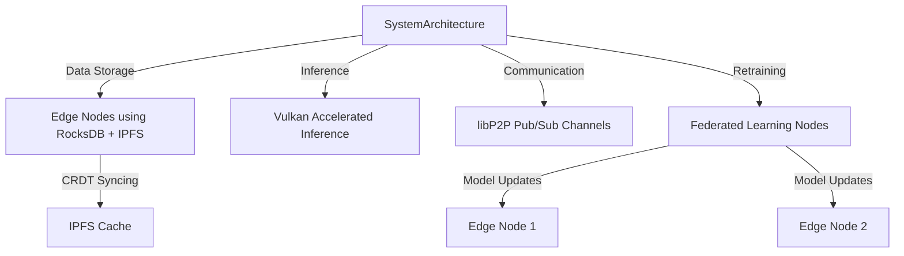

# Overview

The GNUS.ai system integrates multiple open-source technologies to build a fully decentralized Retrieval-Augmented Generation (RAG) architecture. 
It leverages:

- **RocksDB over IPFS** for distributed storage and CRDT-based synchronization.
- **Vulkan shaders and ggml** for high-performance inference on GPUs.
- **MNN (Mobile Neural Network)** to dynamically load and execute models at the edge nodes.
- **Pub/Sub communication over libP2P** for distributed query handling across nodes.
- **Federated learning principles** to allow local model retraining and fine-tuning on each node.

This architecture ensures scalability, fault tolerance, and security while minimizing latency in both data access and inference.

