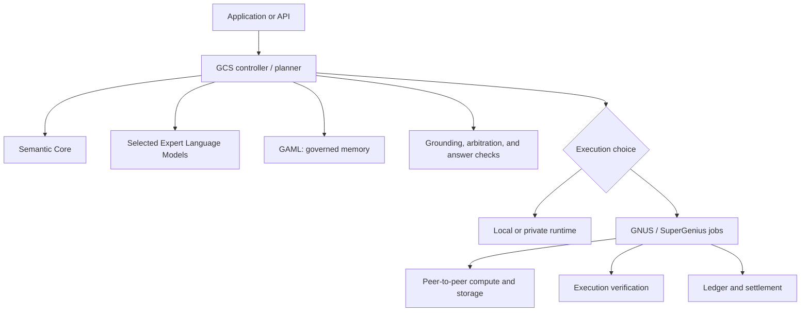

# Overview

## Separate cognition from execution

The GNUS.ai platform has two complementary concerns:

1. **Genius Cognitive System (GCS):** A controller/planner selects a Semantic Core and task-appropriate Expert Language Models (ELMs), assembles relevant GAML memory under privacy and retention rules, mediates tools, and checks or arbitrates results.
2. **GNUS / SuperGenius:** Provides the execution, storage, peer-to-peer, proof, ledger, and settlement capabilities for eligible distributed jobs. A GCS request need not use the public network; local and private execution are supported architectural modes.

**This is not conventional agent orchestration plus a sharded large model.** ELMs are specialized models or roles selected per task; GAML is governed, structured memory rather than unbounded conversation replay. Answer quality checks and execution-integrity checks are separate concerns. The complete cognitive design is documented at [gcs.gnus.ai](https://gcs.gnus.ai/).

```mermaid
flowchart TD
    Client[Application or API] --> GCS[GCS controller / planner]
    GCS --> Core[Semantic Core]
    GCS --> Experts[Selected Expert Language Models]
    GCS --> Memory[GAML: governed memory]
    GCS --> Checks[Grounding, arbitration, and answer checks]
    GCS --> Execution{Execution choice}
    Execution --> Local[Local or private runtime]
    Execution --> Swarm[GNUS / SuperGenius jobs]
    Swarm --> P2P[Peer-to-peer compute and storage]
    Swarm --> Verify[Execution verification]
    Swarm --> Settle[Ledger and settlement]
```

## Infrastructure building blocks

The earlier distributed retrieval and processing design uses:

- **RocksDB and IPFS** for storage, with CRDT-based synchronization where appropriate.
- **Vulkan, ggml, and MNN** for supported local processing and inference paths.
- **libp2p pub/sub** for distributed communication.
- **Retrieval and training workflows** for workloads that need distributed RAG or model updates.

These components describe possible execution paths, **not** a guarantee that every GCS feature or distributed workflow is already deployed or that results are deterministic across all GPU vendors. For current release status see [Platform Status](../../about-gnus.ai/release-status.md); for subsystem ownership see [Master Architecture](../MASTER_ARCHITECTURE.md).

## Reading the rest of this section

The [Query Workflow](query-workflow.md), [Data Storage](data-storage.md), [Pub/Sub Communication](pub-sub-communication.md), and [Retraining Mechanism](retraining-mechanism.md) pages cover individual infrastructure designs. They should not be read as a complete description of GCS reasoning or memory.
