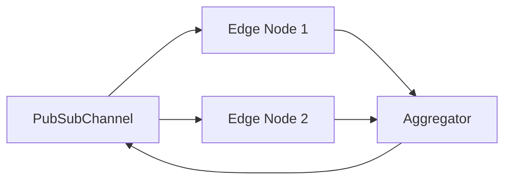

# Pub/Sub Communication

## Communication Workflow

- Queries and updates are handled through **libP2P pub/sub channels**.
- Fault-tolerant message propagation ensures that even if some nodes fail, others can handle the query.

