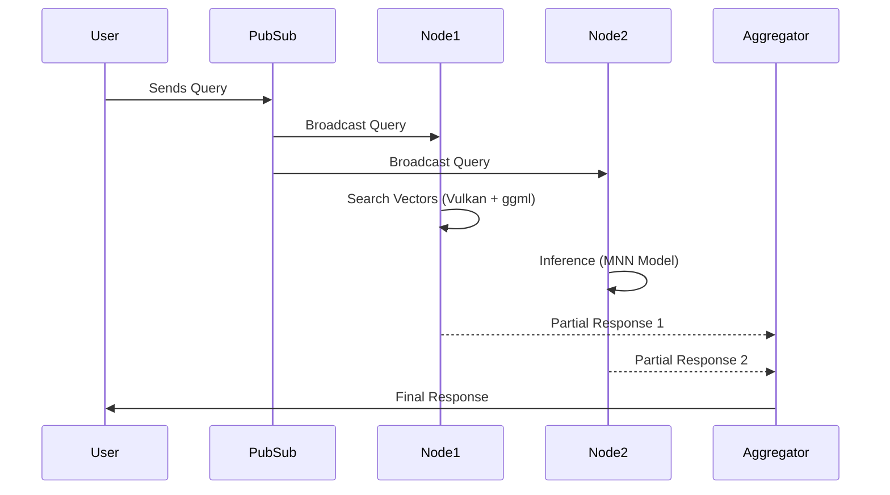

# Query Workflow

## Detailed Query Workflow

1. **Query Reception**:
   - Queries are broadcasted via **pub/sub channels** to all relevant nodes.
   - Each node decides if it has the matching vector slice to respond.

2. **Vector Search and Model Inference**:
   - Nodes execute **vector similarity searches** with Vulkan-accelerated GPUs using **ggml libraries**.
   - **MNN models** are loaded dynamically based on the type of query.

3. **Response Generation and Aggregation**:
   - Partial responses from each node are aggregated into a final response by a designated aggregator node or function.

