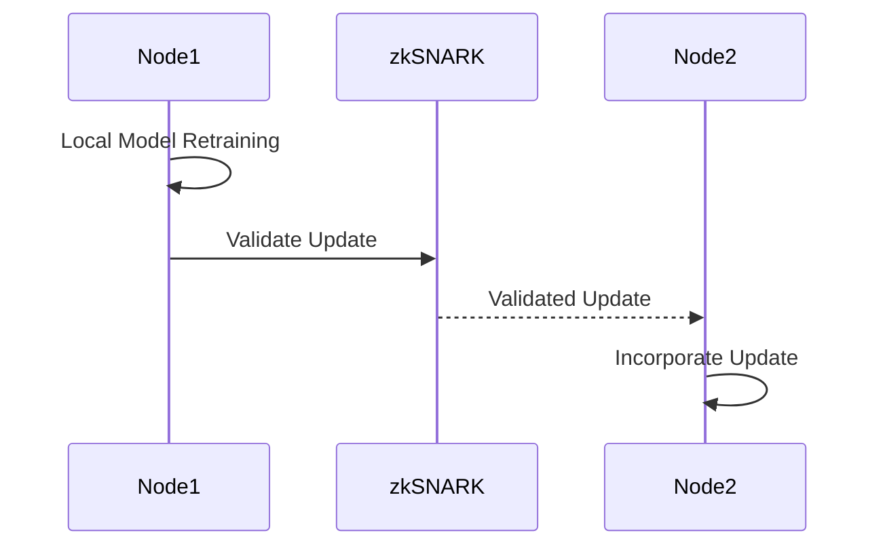

# Retraining Mechanism

## Federated Learning and Model Updates

Each node performs **local model retraining** based on new data and shares relevant updates across the network.

1. **Local Training**:
   - Nodes collect interaction data and retrain models locally.

2. **zk-SNARK Validation**:
   - Model updates are validated and signed before sharing.

3. **Selective Sharing**:
   - Updates are broadcasted only to relevant nodes.

