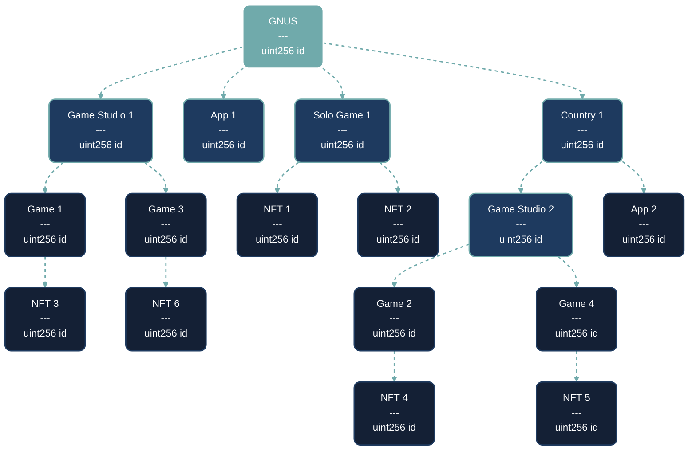

# Hybrid Smart Contract

The GNUS.ai smart contract is a hierarchical container for ERC-1155 tokens, and the GNUS token is an ERC-20 token.&#x20;

```mermaid
%%{init: {'theme': 'dark', 'themeVariables': { 'primaryColor': '#70AAAB', 'secondaryColor': '#1e3a5f', 'tertiaryColor': '#142035', 'edgeLabelBackground':'#ccc', 'fontFamily':'"Trebuchet MS", Verdana, sans-serif', 'background': '#2e2e2e'}}}%%
graph TD
    classDef root fill:#70AAAB,stroke:#ffffff,stroke-width:2px,color:#ffffff,rx: 10, ry: 10;
    classDef child fill:#1e3a5f,stroke:#70AAAB,stroke-width:2px,color:#ffffff,rx: 10, ry: 10;
    classDef leaf fill:#142035,stroke:#1e3a5f,stroke-width:2px,color:#ffffff,rx: 10, ry: 10;
    linkStyle default stroke:#70AAAB,stroke-width:2px,fill:none,stroke-dasharray: 5 5;

    GNUS["GNUS\n---\nuint256 id"]:::root
    GNUS --> Game_Studio_1["Game Studio 1\n---\nuint256 id"]:::child
    GNUS --> App_1["App 1\n---\nuint256 id"]:::child
    GNUS --> Solo_Game_1["Solo Game 1\n---\nuint256 id"]:::child
    GNUS --> Country_1["Country 1\n---\nuint256 id"]:::child

    Game_Studio_1 --> Game_1["Game 1\n---\nuint256 id"]:::leaf
    Game_Studio_1 --> Game_3["Game 3\n---\nuint256 id"]:::leaf

    Solo_Game_1 --> NFT_1["NFT 1\n---\nuint256 id"]:::leaf
    Solo_Game_1 --> NFT_2["NFT 2\n---\nuint256 id"]:::leaf

    Country_1 --> Game_Studio_2["Game Studio 2\n---\nuint256 id"]:::child
    Country_1 --> App_2["App 2\n---\nuint256 id"]:::leaf

    Game_Studio_2 --> Game_2["Game 2\n---\nuint256 id"]:::leaf
    Game_Studio_2 --> Game_4["Game 4\n---\nuint256 id"]:::leaf

    Game_1 --> NFT_3["NFT 3\n---\nuint256 id"]:::leaf
    Game_3 --> NFT_6["NFT 6\n---\nuint256 id"]:::leaf

    Game_2 --> NFT_4["NFT 4\n---\nuint256 id"]:::leaf
    Game_4 --> NFT_5["NFT 5\n---\nuint256 id"]:::leaf

```

