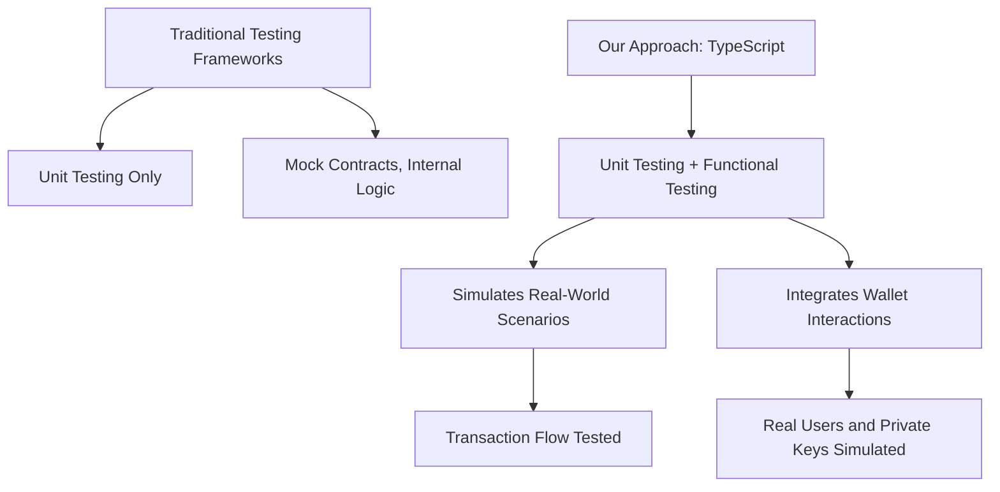
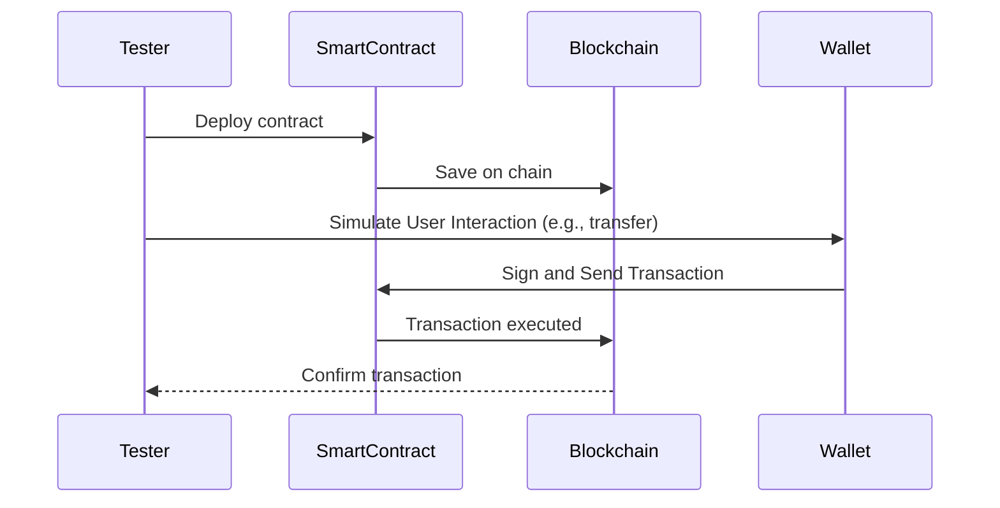
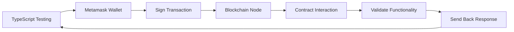
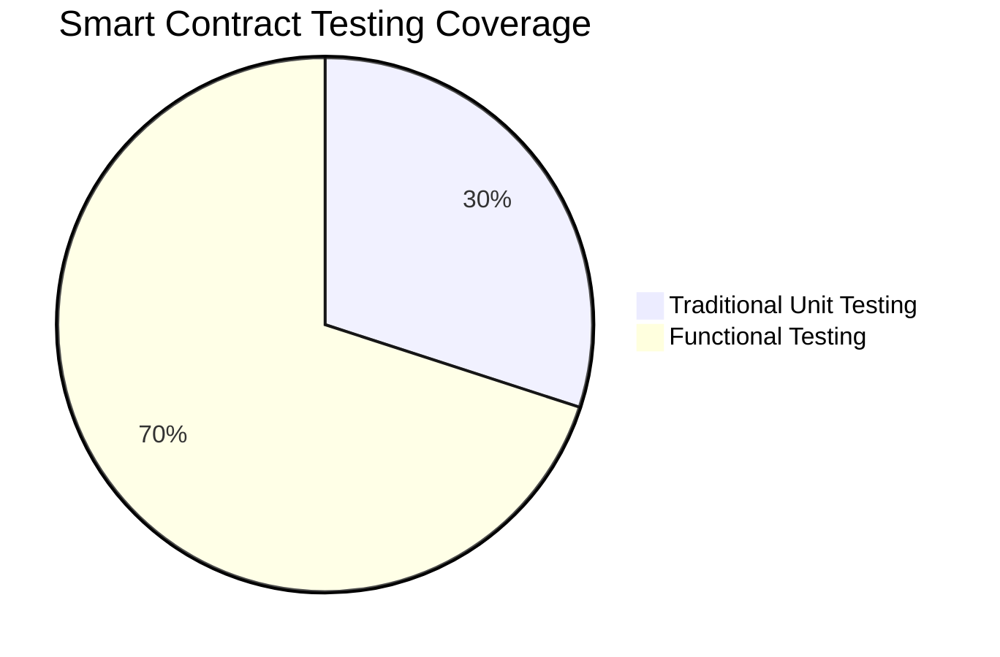

# Our Smart Contract Testing Philosophy

### Our Smart Contract Testing Philosophy

At Genius Ventures, we don't stop at just unit testing. While many engineers focus solely on unit testing their smart contracts, we take a more comprehensive approach by combining both **Unit** and **Functional Testing** to ensure our smart contracts work in real-world applications.

#### Why TypeScript for Testing?

We use **TypeScript** for our smart contract tests. Here's why:

* **Comprehensive Testing**: With TypeScript, we can perform both unit tests (validating the internal logic of the contract) and functional tests (simulating real-world scenarios).
* **Real-World Interactions**: TypeScript allows us to interact with actual wallets like Metamask, run transactions, and test user flows.

***

#### Traditional Frameworks: What's Missing?

Traditional Solidity testing frameworks like Truffle, Brownie, and Forge Foundry are excellent for fast unit testing but often miss the mark when it comes to full functional testing.

* **Unit Testing**: These frameworks are great for creating mocks or stubs for unit tests.
* **Functional Testing**: They usually lack built-in support for real-world integrations, requiring external tools for wallet interactions, private keys, and more.

***

#### Benefits of Functional Testing

By using TypeScript and frameworks like **Hardhat** and **ethers.js**, we can:

* Simulate real-world usage scenarios.
* Ensure full contract functionality beyond isolated unit tests.
* Test wallet interactions and transaction flows.

***

#### Wallet Integration and Real-World Usage

Using **private keys** directly in our tests allows us to simulate actual user actions, from signing transactions to transferring tokens. This is something that unit testing frameworks like Truffle or Foundry don't handle natively, making our testing process more aligned with real-world operations.

***

#### Conclusion: TypeScript Testing Done Right

Our philosophy is simple: **real-world scenarios need real-world testing**. While traditional testing frameworks like Forge Foundry, Truffle, and Brownie are excellent for unit tests, they don't provide the comprehensive coverage we need for full integration. That's why we chose TypeScript to ensure our smart contracts not only work in isolation but also in the live environments where they’ll be used.

