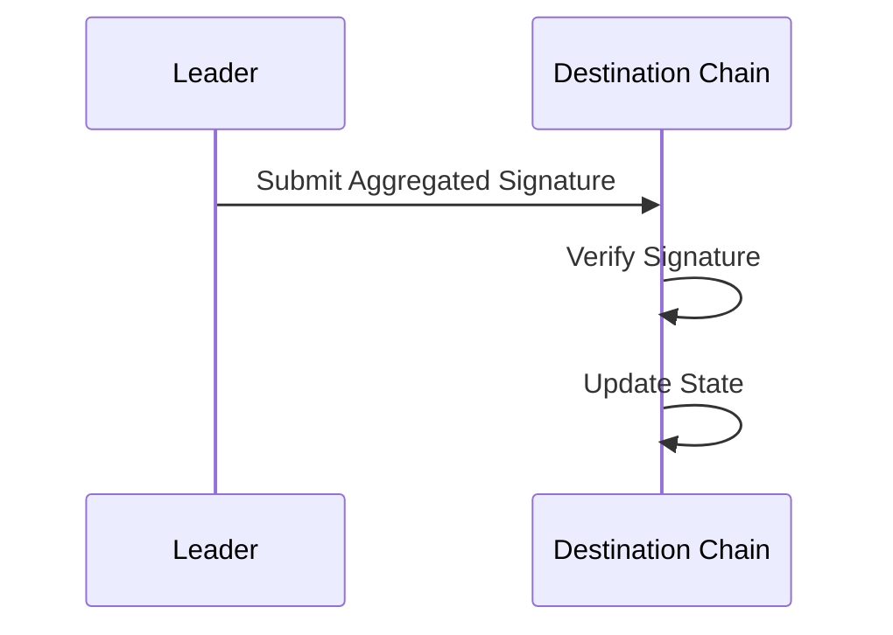

# Destination Chain Submission and Validation

## Submission to Destination Chain
- **Sending the Proof**: The aggregated signature and verification results are packaged and sent to the destination chain for processing.
- **Transaction Creation**: A transaction is created on the destination chain that includes the message, the aggregated signature, and any supporting data.

```cpp
void submitToDestinationChain(Message message, std::string aggregatedSignature) {
    log("Submitting verification result to destination chain");
    Transaction tx = createTransaction(message, aggregatedSignature);
    destinationChain.submitTransaction(tx);
}
```

## Validation on Destination Chain
- **Smart Contract Validation**: A smart contract on the destination chain verifies the aggregated signature to ensure that the message was validated by the required number of nodes.
- **State Update**: If the verification is successful, the state on the destination chain is updated accordingly (e.g., minting tokens, updating balances).

```solidity
function validateAndProcess(bytes memory message, bytes memory aggregatedSignature) public {
    require(verifyAggregatedSignature(message, aggregatedSignature), "Invalid signature");
    // Proceed with state update
}
```

## Submission and Validation Flow Diagram

