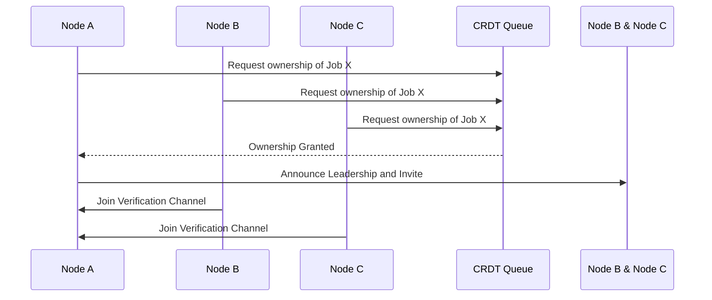

# Message Creation and Leader Election

## Message Creation
- **Trigger Event**: The message verification process starts when a new event (e.g., a token burn) occurs on the source chain.
- **Queue Job Creation**: The event is recorded as a job in a distributed CRDT-based queue that manages subtasks.
- **Job State**: Jobs in the queue have states such as "pending", "in progress", and "completed".

## Leader Election
- **Leader Election Trigger**: Nodes connected to the network observe the pending jobs and attempt to acquire ownership using a distributed lock.
- **Lock Mechanism**: Ownership is requested through a CRDT lock, which guarantees that only one node successfully acquires the job to proceed as the leader.

```cpp
// Function to attempt leader election for a message job
bool attemptOwnership(Job job) {
    bool lockAcquired = job_lock.tryAcquire(job.id);
    if (lockAcquired) {
        log("Node " + nodeId + " has become the leader for job " + job.id);
        becomeLeader(job);
    }
    return lockAcquired;
}
```

## Topic Creation by Leader
- **Leader Creates Channel**: The node that acquires ownership becomes the leader and creates a new IPFS pub/sub topic for message verification.
- **Announcement**: The leader node announces the creation of the channel, inviting other nodes to join.

```cpp
void becomeLeader(Job job) {
    std::string topic = createVerificationTopic(job);
    setupPubSubChannel(topic);
    inviteNodesToChannel(topic);
}
```

## Diagram: Leader Election Flow

    