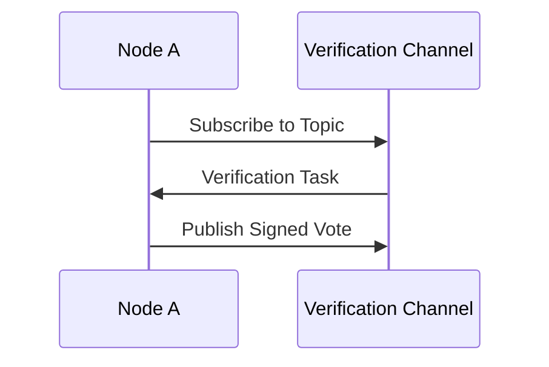

# Node Verification and Voting

## Node Participation in Verification
- **Joining the Channel**: Nodes that receive an invitation from the leader join the IPFS pub/sub channel.
- **Verification Task**: Each node verifies the message according to predefined criteria (e.g., checking transaction validity, ensuring it meets consensus rules).

## Voting on Message Validity
- **Vote Casting**: Once verification is complete, nodes cast their vote on whether the message is valid.
- **Vote Signing**: Nodes sign their vote using their private keys to ensure authenticity.

```cpp
void participateInVerification(std::string topic, Message message) {
    log("Node " + nodeId + " joining verification channel: " + topic);
    pubsub.subscribeToTopic(topic);

    bool isValid = verifyMessage(message);
    std::string vote = isValid ? "valid" : "invalid";
    std::string signedVote = signVote(vote);

    pubsub.publishVote(topic, signedVote);
}
```

## Verification Flow Diagram

