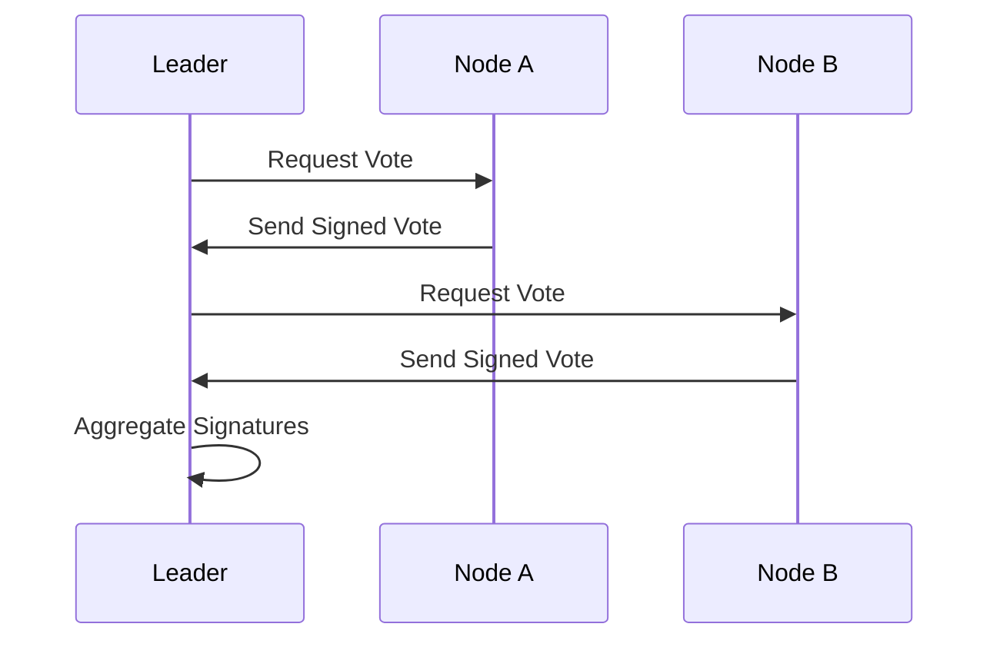

# Signature Collection and Aggregation

## Collecting Votes
- **Leader Collects Votes**: The leader collects signed votes from all participating nodes in the verification channel.
- **Threshold for Consensus**: A predefined threshold (e.g., majority or supermajority) is used to determine if the message is valid.

## Signature Aggregation
- **Aggregating Signatures**: To reduce data size, signatures are aggregated using schemes like BLS (Boneh–Lynn–Shacham) signatures, resulting in a single compact signature that represents the collective votes.

```cpp
void collectAndAggregateVotes(std::string topic) {
    log("Leader collecting votes on topic: " + topic);
    std::vector<std::string> votes = pubsub.collectVotes(topic);

    std::string aggregatedSignature = aggregateSignatures(votes);
    log("Aggregated Signature: " + aggregatedSignature);
}
```

## Vote Collection Flow Diagram

