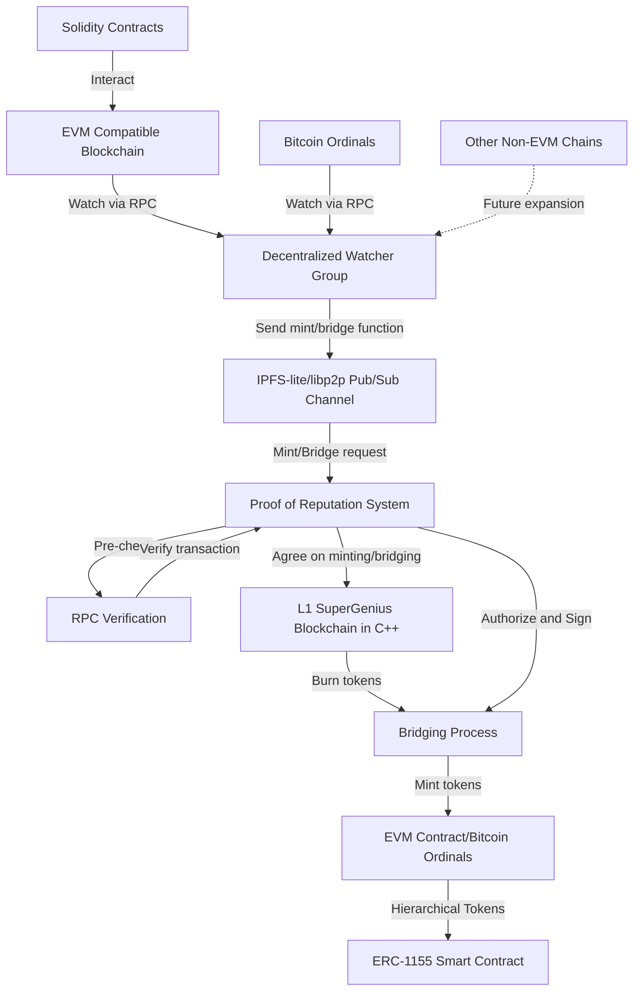

# Cross-chain Bridging to SuperGenius

The GNUS.ai cross-chain watcher and minting system employs a decentralized network of nodes to monitor and interact with multiple blockchains, including EVM-compatible chains and Bitcoin ordinals. Using IPFS-lite and libp2p for communication, the system processes relevant transactions, initiates minting requests, and handles cross-chain bridging. A Proof of Reputation mechanism, involving high-reputation nodes, verifies and approves these requests before execution on a custom L1 blockchain. The system now includes bridging capabilities, allowing for the burning of tokens on the L1 SuperGenius C++ blockchain and minting of corresponding tokens on EVM chains or Bitcoin Ordinals. This architecture enables seamless interaction and token transfer across different blockchain ecosystems, with built-in scalability for future expansion to additional networks.

1. Decentralized Watcher Group:
   * Composed of nodes that watch multiple blockchains via RPC.
   * Monitors EVM-compatible chains, Bitcoin ordinals, and potentially other chains in the future.
   * When a relevant transaction is detected, it prepares a minting, bridging in, or bridging out request.
   * Nodes reach consensus on the latest transaction ID for all operations.
2. IPFS-lite and libp2p:
   * Provides the decentralized communication infrastructure.
   * Sets up pub/sub channels for nodes to communicate.
3. Consensus and Verification System:
   * Receives minting, bridging in, and bridging out requests from the watcher group.
   * Nodes agree on the latest transaction ID for each operation.
   * Uses zkSnarks to verify the validity of transactions.
   * zkSnarks and recursive snarks are employed to aggregate and validate transaction data from previous transactions.
4. L1 SuperGenius Blockchain (in C++):
   * The underlying blockchain where minting occurs and tokens can be burned for bridging out.
   * Receives and processes approved minting and bridging transactions.
5. Solidity Contracts:
   * Deployed on multiple EVM chains.
   * Interact with the main system, possibly triggering events that the watcher group monitors.
   * Include ERC-1155 smart contracts for hierarchical token management.
6. Bridging Functionality:
   * Bridging In: Allows for burning tokens on external chains and minting on the L1 SuperGenius blockchain.
   * Bridging Out: Facilitates burning tokens on the L1 SuperGenius blockchain and minting on target chains.
   * Trusted nodes have gas fees and signing authority to mint tokens on the target EVM chain or Bitcoin Ordinals.
   * Manages bridging of child tokens in the EVM contract, maintaining a hierarchical token system under the Genius Tokens & NFT Collections contract.

Here's how the process flows, including bridging out:

1. The watcher group monitors transactions on various blockchains (EVM-compatible chains, Bitcoin ordinals, etc.).
2. When a relevant transaction is detected (minting, bridging in, or bridging out), a watcher node prepares the appropriate request.
3. The request is sent through the IPFS-lite/libp2p pub/sub channel, including:
   * The function call (mint, bridge in, or bridge out)
   * The source chain ID
   * The transaction ID
   * For bridging out: the target chain ID and token details
4. Nodes in the network reach consensus on the latest transaction ID for the operation.
5. zkSnarks are used to verify the validity of the transaction, including aggregating data from previous transactions.
6. If the verification passes:
   * For minting or bridging in: the approved transaction is sent to the L1 SuperGenius blockchain for execution.
   * For bridging out: the burn transaction is executed on the L1 SuperGenius blockchain.
7. For bridging out:
   * Trusted nodes with appropriate permissions receive the bridge out request.
   * These nodes use their gas fees and signing authority to mint the corresponding tokens on the target chain (EVM or Bitcoin Ordinals).
   * The minting includes creating the appropriate hierarchical structure in the ERC-1155 smart contract on the target chain.

For our implementation of this architecture, we have:

1. Implemented a robust RPC client in C++ capable of interacting with various blockchains.
2. Developed an efficient consensus mechanism for nodes to agree on the latest transaction IDs.
3. Implemented zkSnark verification for transaction validation and data aggregation.
4. Designed and built a flexible pub/sub system using IPFS-lite and libp2p that handles different types of messages (e.g., minting requests, bridging in/out requests, verification results).
5. Created a standardized format for minting and bridging (in/out) requests that includes all necessary information.
6. Implemented proper error handling and recovery mechanisms throughout the system.
7. Ensured the system's scalability to handle future expansion to other chains like Solana.
8. Developed secure mechanisms for trusted nodes to hold and manage gas fees and signing authorities for different target chains.
9. Implemented a secure system for managing and updating the list of trusted nodes with bridging out permissions.
10. Created a mechanism to track and maintain the hierarchical token structure across different chains during bridging operations.

We are now in the process of integrating these subcomponents into a cohesive system, fine-tuning their interactions, and conducting comprehensive testing to ensure smooth operation across various blockchain ecosystems.

