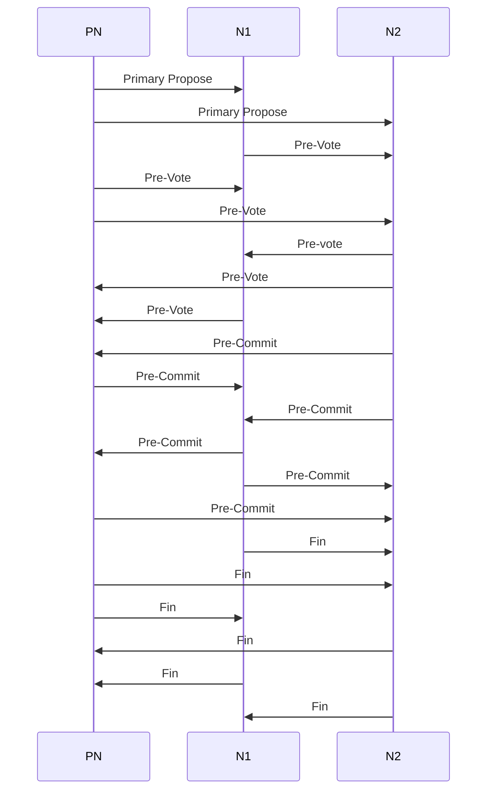

# SG Consensus Algorithm Implementation

* SG Consensus algorithm is based on GOSSIP protocol.
* System uses libp2p library for P2P Gossip messaging.

**Gossip Message Types**

* BLOCK ANNOUNCE
* VERIFICATION
* TRANSACTIONS
* STATUS
* BLOCK REQUEST

Consensus protocol uses `VERIFICATION` gossip message for consensus process. There are two different types of VERIFICATION message

1. VOTE message
2. FIN message

There are three different types of Vote Messages\
\
**Primary Propose**\
Primary node broadcasts Primary Propose message to all nodes to validate a transaction.\
**Pre Vote**\
Nodes after receiving Primary Propose send Pre-Vote message (initial vote) to all other nodes.\
**Pre Commit**\
Nodes after receiving pre-votes from other nodes sends stronger commitment using pre-commit vote. 

**Vote Message Format**\
\| `Voting Round Number` | `Membership Counter` | `Message Data` |

## Consensus Protocol Message Sequences

