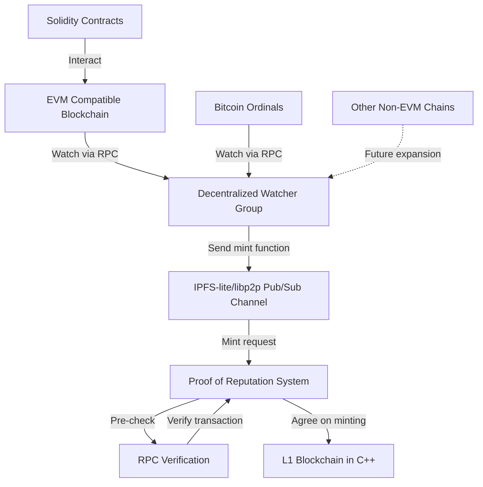

# Cross-chain Bridging to SuperGenius

The GNUS.ai cross-chain watcher and minting system employs a decentralized network of nodes to monitor multiple blockchains, including EVM-compatible chains and Bitcoin ordinals. Using IPFS-lite and libp2p for communication, the system processes relevant transactions and initiates minting requests. A Proof of Reputation mechanism, involving high-reputation nodes, verifies and approves these requests before execution on a custom L1 blockchain. This architecture enables seamless interaction across different blockchain ecosystems, with built-in scalability for future expansion to additional networks.

1. Decentralized Watcher Group:
   * Composed of nodes (possibly trusted nodes) that watch multiple blockchains via RPC.
   * Monitors EVM-compatible chains, Bitcoin ordinals, and potentially other chains in the future.
   * When a relevant transaction is detected, it prepares a minting request.
2. IPFS-lite and libp2p:
   * Provides the decentralized communication infrastructure.
   * Sets up pub/sub channels for nodes to communicate.
3. Proof of Reputation System:
   * Includes high-reputation nodes.
   * Receives minting requests from the watcher group.
   * Performs pre-checks using RPC calls to verify transactions.
   * Uses zkSnarks and recursive snarks for minting transactions.
4. L1 Blockchain (in C++):
   * The underlying blockchain where minting occurs.
   * Receives and processes approved minting transactions.
5. Solidity Contracts:
   * Deployed on multiple EVM chains.
   * Interact with the main system, possibly triggering events that the watcher group monitors.

Here's how the process flows:

1. The watcher group monitors transactions on various blockchains (EVM-compatible chains, Bitcoin ordinals, etc.).
2. When a relevant transaction is detected, a watcher node prepares a minting request.
3. The minting request is sent through the IPFS-lite/libp2p pub/sub channel, including:
   * The mint function call
   * The source chain ID
   * The transaction ID
4. The Proof of Reputation system receives the minting request.
5. High-reputation nodes perform pre-checks using RPC calls to verify the transaction on the source chain.
6. If the verification passes, the nodes in the Proof of Reputation system reach a consensus on the minting transaction, via zkSnark verification to aggregate the transaction data from the previous minting transaction.
7. The approved minting transaction is then sent to the L1 blockchain (written in C++) for execution.

For our implemention this architecture:

1. Implementing a robust RPC client in C++ that can interact with various blockchains.
2. Developed a secure and efficient consensus mechanism for the Proof of Reputation system.
3. Designed a flexible pub/sub system using IPFS-lite and libp2p that can handle different types of messages (e.g., minting requests, verification results).
4. Created a standardized format for minting requests that includes all necessary information.
5. Implement proper error handling and recovery mechanisms throughout the system.
6. Ensure the system is scalable to handle future expansion to other chains like Solana.

