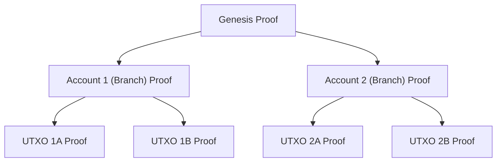

# Minimal MMR Proof System with UTXOs

The GNUS.ai blockchain architecture leverages a combination of Merkle Mountain Range (MMR) with Unspent Transaction Outputs (UTXOs) and Nova over PLONK for Incrementally Verifiable Computations (IVC). This design enhances scalability, security, and efficiency within the blockchain ecosystem.

### **Key Components**

1. **Merkle Mountain Range (MMR) with UTXOs:**
   * MMR provides an efficient, append-only data structure via a CRDT database
   * Nodes store only the Genesis Node, their branch node, and the last two UTXOs.
2. **Nova over PLONK for IVC:**
   * Using Placeholder Proof System in C++
   * Nova enables efficient folding schemes.
   * PLONK provides succinct, zero-knowledge proofs.
   * Proofs are incrementally updated from the Genesis block through branch nodes to individual UTXOs.

### **Detailed Mechanism**

1. **Genesis Node and Proof:**
   * The Genesis Node contains the initial state.
   * An IVC proof is established at the Genesis Node using Nova over PLONK.
2. **Branch Node (Account Creation):**
   * New accounts create branch nodes from the Genesis Node.
   * The proof for the branch node is an incremental proof based on the Genesis proof.
3. **Transaction and UTXO Handling:**
   * Each transaction creates a new UTXO, generating an incremental proof.
   * Nodes store the last two unspent UTXOs, reducing storage requirements.
   * Each UTXO transaction is verifiable within the branch’s incremental proof chain.
4. **Incremental Verification:**
   * New proofs build on previous proofs, ensuring efficiency.
   * Only the Genesis proof, branch proof, and recent UTXOs are needed for verification.

### **Benefits**

1. **Scalability:**
   * Reduced storage requirements per node.
   * Efficient verification without storing the entire chain.
2. **Security:**
   * Zero-knowledge proofs ensure data privacy.
   * Incremental proofs maintain integrity and trust.
3. **Efficiency:**
   * Fast proof generation and verification.
   * Simplified storage and data retrieval.
