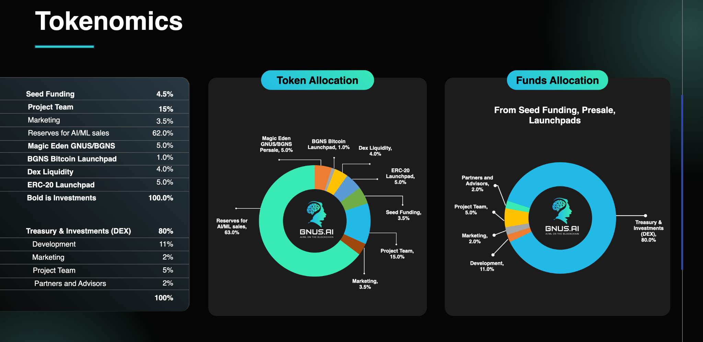

# Tokenomics

Disclosure of Funds Raised, Token Distributions, and Funds Usage

<figure><figcaption>
Tokenomics for Token Raise Distribution
</figcaption></figure>

## Compute-Driven Token Growth

The following graph shows our Monte Carlo simulation using two Enterprises buying AI/ML processing and three games with 12 online players.

* Multiple Revenue Streams
  * AI/ML Processing revenue, as well as Crypto & NFT trading fee revenue
* Crypt Token Advantages
  * Mint & Burn allows configurable profits.&#x20;
* Investments Scale the Network
  * Investments are used to scale the network by adding nodes.
* Monte-Carlo Analysis Simulation
  * Monte-Carlo Analysis shows the network effect. Faster network scaling increases GNUS token price faster.

<figure><figcaption>
Compute-Driven Token Growth over 700 days
</figcaption></figure>

*
